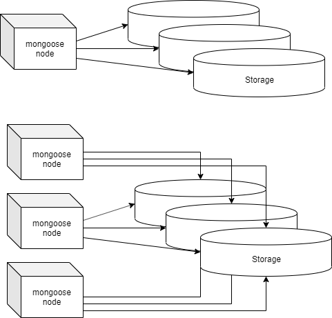
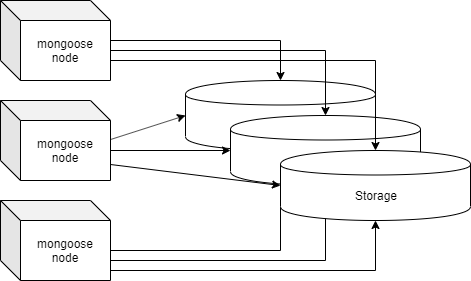

# Modes

Mongoose can be launched in 2 main modes:
* **Standalone** mode
* **Distributed** mode

## Standalone mode

This is the easiest way to use mongoose. In this case, one mongoose instance is launched and the load on the storage generated from it. This mode **does not require any additional parameters**.

## Distributed mode

This mod is used for distributed load on the storage. This mode is used **not** for a **distributed storage** (this function is also supported in a standalone mode), but for **several instances of the mongoose**.
This mod is used to increase the load on the stoarge. 
[Detailed documentation](distributed_mode)

# Other modes:

* [Recycle mode](../recycle_mode)
* [Copy mode](../copy_mode)
