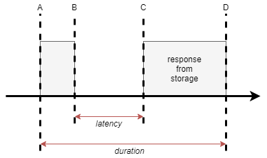

# FAQ

## What is *latency* and *duration*?

A = mongoose start formulate a request
B = mongoose sent the first byte to storage
C = mongoose get the first byte of response from storage
D = mongoose get the last byte of response from storage; operation finish

**Latency = C-B** : this value is measured in nanoseconds and shows how much time passed since mongoose sent first byte to storage till first byte  from storage was returned. This value depends on object size in case of Create or Update, and doesn't in case of Read and Delete.

**Duration = D-A** : total operation time (this value is measured in nanoseconds).
