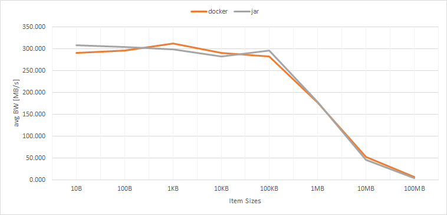
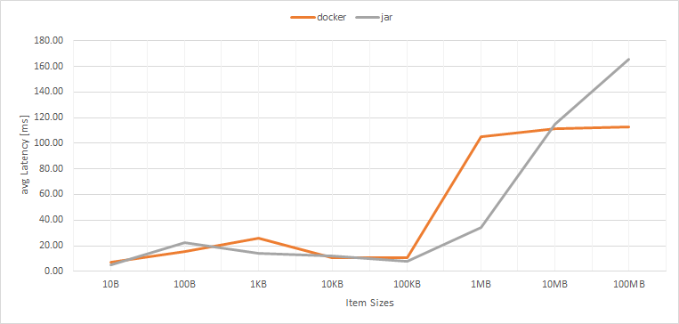

# FAQ

## What is *latency* and *duration*?

A = mongoose start formulate a request

B = mongoose sent the first byte to storage

C = mongoose get the first byte of response from storage

D = mongoose get the last byte of response from storage; operation finish

**Latency = C-B** : this value is measured in nanoseconds and shows how much time passed since mongoose sent first byte to storage till first byte  from storage was returned. This value depends on object size in case of Create or Update, and doesn't in case of Read and Delete.

**Duration = D-A** : total operation time (this value is measured in nanoseconds).

## What is *concurrency*?

**Concurrency level** = count of concurrently executed load operations/ the number of open connections at any moment of time ( in terms of the [netty driver](https://github.com/emc-mongoose/mongoose-storage-driver-netty) and its ["child" drivers](https://github.com/emc-mongoose/mongoose#dependency)).

## How to deploy with docker or jar?

We recommend deploying the mongoose with **docker**, because:

* no need to have specific version of java on your machine;
* no need to search for the latest jar file and download it from maven;
* no need to search and download jar with extensions for each storage driver;
* and all the other [advantages of docker](https://dzone.com/articles/top-10-benefits-of-using-docker)

## Does docker affect tool performance?

3 tests were performed for each item-size (10B-100MB):
  * mongoose-storage-driver-s3 + minio server
  * standalone mode
  * CREATE operations

AVG Bandwith:

AVG Latency:

